Java PC_Manager Program
===

PC 관리 프로젝트

- 핵심 목표: 학교에서 했던 프로젝트를 완벽한 프로그램으로 만들자!!
- Keyword: MVC, Thread, Socket, GSON, Singleton, Weather API(Open API), DOM(parser), MySQL, JSON, Maven, Server-Client

기존 프로젝트에서 추가된 기능: 고객 관리창의 좌석 선택하는 이벤트 추가, 주문 받은 리스트 처리 기능 추가, 관리자에서 1:1 채팅을 보낼때 체크하는 콤보박스 에러 해결과 기타 잡버그 수정, 관리자가 Client를 로그아웃 시키는 기능 추가.

> Readme 작성중...

 

샘플 화면
---
개발 환경이 윈도우이기 때문에 윈도우 운영체제에서 실행 하였습니다.

| 유저 로그인 | 관리자 로그인 |
|:----------------------------------------:|:-----------------------------------------:|
|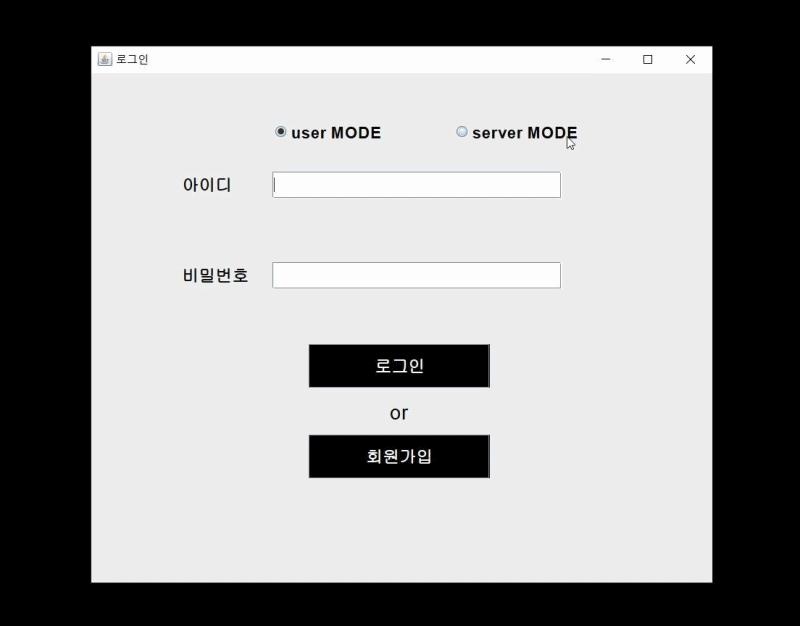|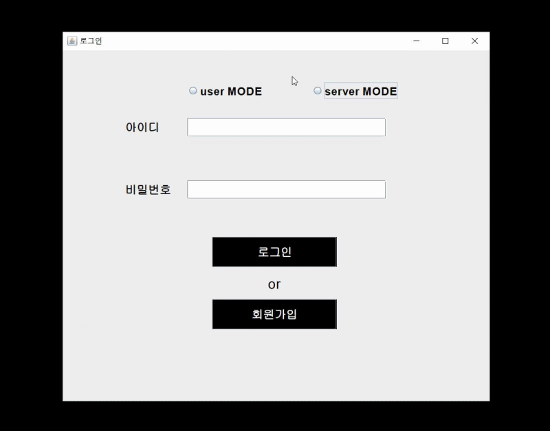|

| 회원가입 ID 중복 예외처리 | 회원가입 성공 |
|:----------------------------------------:|:-----------------------------------------:|
|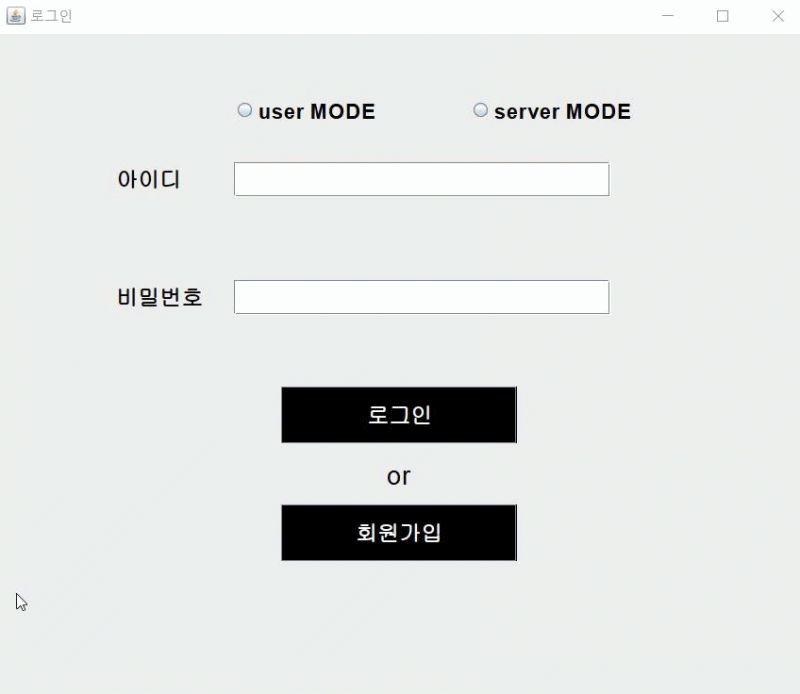|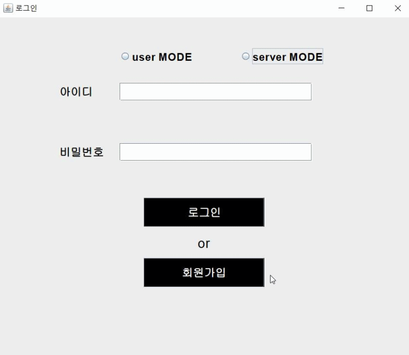|

| 전체 채팅 or 1:1 채팅 |
|:----------------------------------------:|
||

| 음식 주문하기 | 주문 리스트 확인 or 가져다주기 버튼 |
|:----------------------------------------:|:-----------------------------------------:|
||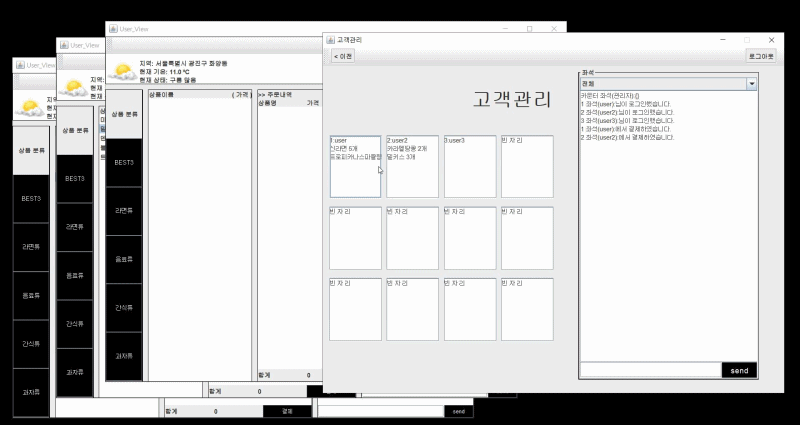|

| 상품관리 (등록, 조회, 삭제) |
|:----------------------------------------:|
|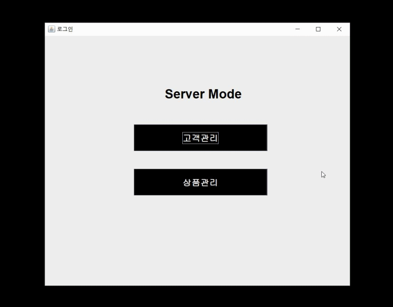|

| 사용자 로그아웃 or 사용자 로그아웃 시키기 |
|:----------------------------------------:|
|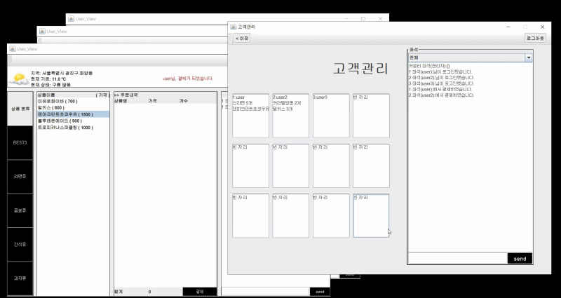|

 

주요 기술 요소
---
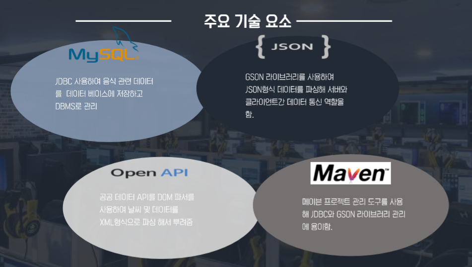

 

개발 중점 사항
---
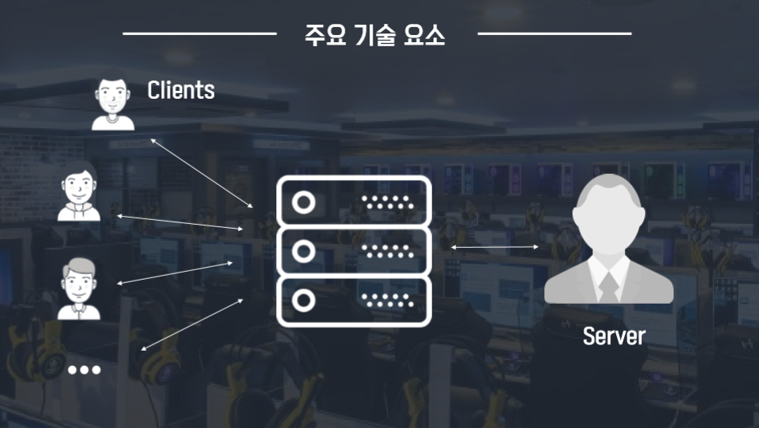

 

개발 과정
---
Commit 로그에 기능 구현 코드와 문제점을 가능한 자세히 적었습니다.

1. View 완성
2. Controller 완성 (Event 처리)
3. Model (DataBase 구축) 완성
4. 날씨 Open API 기능 구현
5. 서버 구축
6. 다중 클라이언트 채팅 완성
7. 1:1 클라이언트 채팅 완성
8. 고객관리 창의 좌석을 버튼 누르면 주문 리스트 창 띄워지도록 바꿈
9. 주문 리스트 창 구현(사용자 로그아웃 시키기, 음식 서비스 전달 완료 버튼)

 

한눈에 보는 전체 시스템 구조도
---
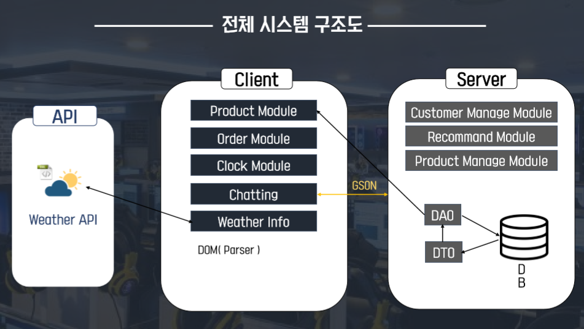

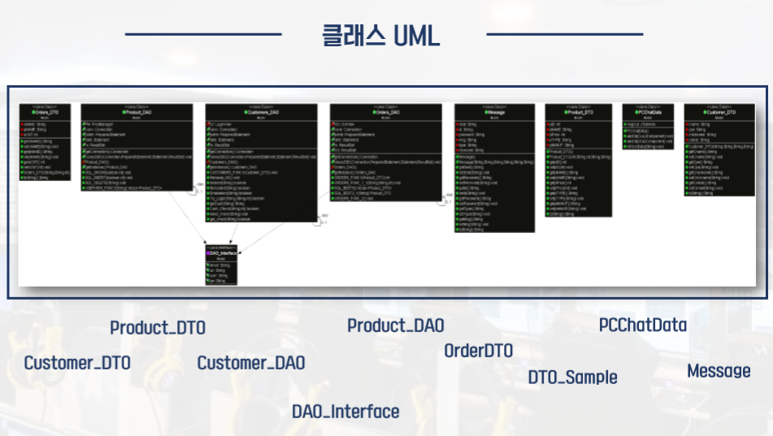
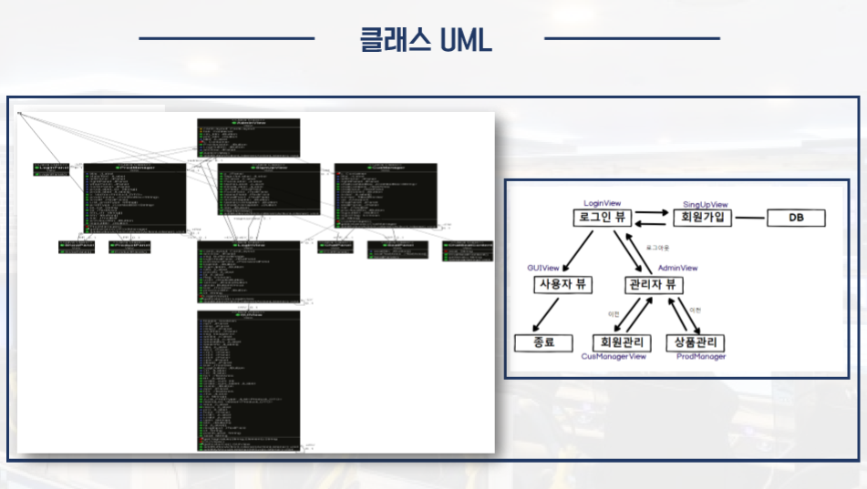
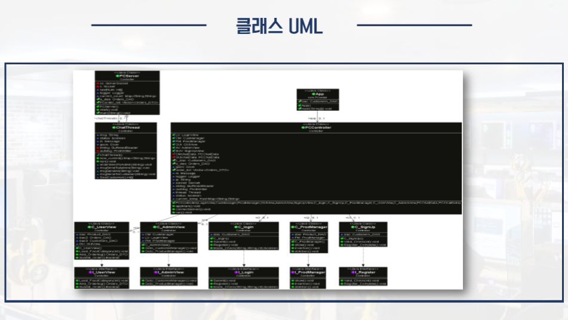

- Client: 
  - 이 클라이언트의 쓰레드는 while문으로 동작한다.
  - 모든 요청은 'PCController'를 거치며 View에서의 모든 Event 처리를 여기서 처리한다.
  - 클라이언트 프로그램이 실행될 때 하나의 소켓이 생성되며 port를 통해 서버와 연결된다.
  - Server와 데이터를 주고받을 때 gson 라이브러리를 통해 JSON 형식인 메세지 객체를 통해 주고받는다.
  - Server가 Client에게 메세지를 보내면 Client의 쓰레드에서 정보를 확인하여 실시간으로 정보를 뿌려준다.
  - 프로그램을 실행할 경우 즉, 로그인할 때마다 생성되는 Client 프로그램은 각각의 쓰레드가 하나씩 존재한다.
  - 서로 다른 클라이언트들은 각각 고객정보 DAO와 주문정보 DAO 객체를 참조할 수 있다. (고객 정보는 예를들어 로그인여부, 주문 정보는 주문 시 데이터베이스에 접근해야 하기 때문이다.)
  - 보여줄 화면객체를 찾았다면 cardLayout을 통해 유저에게 화면을 보여준다.
  - 모든 컨트롤러와 서비스, 뷰는 싱글톤으로 구성되어 있다.
  - 서버에 들어오는 모든 메세지를 BufferedReader로 읽어들인다.
  - 프로그램을 종료시킬 때 스레드를 stop하는 것이 아닌 status라는 bool값을 false로 두어 스레드가 동작중인 while 문에서 자연스럽게 빠져나와 종료되도록 한다.

 
 

- Server:
  - 이 서버의 쓰레드는 while문으로 동작한다.
  - 서버는 실행과 동시에 ServerSocket과 그냥 Socket을 하나씩만 만들어 서버에 들어오는 모든 요청을 받는다.
  - 서버는 열려있는 클라이언트의 쓰레드들을 ArrayList에 저장하여 필요할 때 특정 클라이언트의 쓰레드에 접근할 수 있다.
  - 각각의 개별적인 쓰레드(각 클라이언트들)에서 서로 다른 클라이언트에 접근하기 위해서는 Server에 메세지를 보내고 Server에서 해당 클라이언트를 찾아 해당 클라이언트의 쓰레드에 메세지를 보내서 Event를 처리하였다.
  - 서버에는 주문 정보 DAO와 DTO 둘 다 참조할 수 있다. (클라이언트에서 요청이 들어오면 주문 정보 database를 처리하고 주문 목록에 대한 정보를 알아내기 위해서이다.)
  - 서버에 들어오는 모든 메세지를 BufferedReader로 읽어들인다.
  - 클라이언트와 똑같이 프로그램을 종료시킬 때 스레드를 stop하는 것이 아닌 status라는 bool값을 false로 두어 스레드가 동작중인 while 문에서 자연스럽게 빠져나와 종료되도록 한다.
  - 제네릭 종류(리스트, 해쉬맵, 벡터 등)들은 JSON으로 변환하여 메세지를 보내지 못한다.(JSON으로 변환할 때 제네릭을 잃어버린다고 한다. 그래서 데이터는 정상적으로 보내지지만 get으로 선택해서 데이터를 쓸 수 없었다.)
  - 상품관리 창의 로그인 여부, 상품 삽입/삭제/수정/검색(CRUD), 음식 주문 여부는 데이터베이스에서 저장된다.

 

어떻게 실행하나요?
---
- [MySQL - WorkBench 데이터 베이스 설정하기](markdown/index/MySQL.md)
  - 위 링크는 WorkBench가 깔려 있다는 전제하에 스키마와 테이블 설정법을 올렸습니다.
  - 데이터베이스가 설정이 되어있지 않으면 실행은 될 수도 있지만 많은 기능들이 실행되지 않습니다.

- 로컬 환경에서 실행하기
  - 로컬 환경이므로 'port' 번호가 '127.0.0.1'인지 확인해야 합니다.
  - DataBase의 root 계정이나 사용하고자 하는 계정의 id와 비밀번호를 틀리지 않게 확인해야 합니다.(PCorder\src\main\java\Model\DAO_Interface.java에서 꼭 확인!!)
  - 인코딩 UTF-8 입니다.
  - 메이븐으로 프로젝트 생성했기 때문에 라이브러리 따로 Import 시킬 필요 없습니다.
  * * *
### Q. 메이븐 라이브러리가 제대로 가져오지 못 할 경우

/사용자/.m2/repository 안에 모든 폴더를 삭제 (repository 폴더 자체를 삭제 X)

이클립스 실행 -> 프로젝트 우클릭 -> maven\Update Proj 클릭.

※ 프로그램 실행 순서 ※ 
  
-> Controller\PCServer.java

-> com.PCorder\App.java

맺으며
---
- 앞으로 사용시간과 잔여시간 기능을 추가할 계획입니다!!!

License
---
This is released under the MIT license. See [LICENSE](LICENSE) for details.
