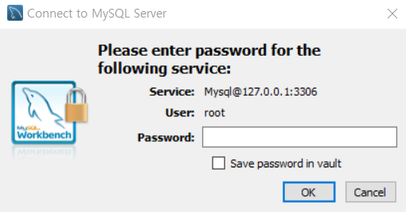
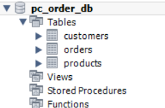
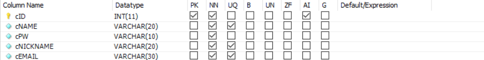
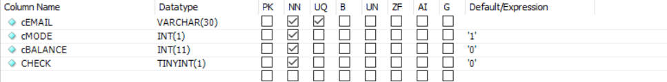
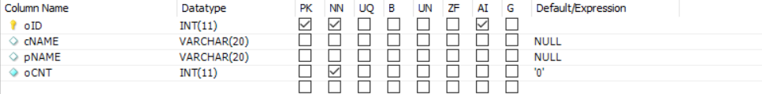
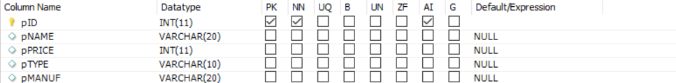

MySQL - WorkBench 설정하기
---
- 저는 MySQL의 WorkBench로 데이터베이스를 사용했더니 CMD로 MySQL 쓰는 것보다 편했습니다.

 

# 초기 설정

 
 

# 스키마 설정
- pc_order_db가 스키마 입니다.

 
 

# 테이블 설정
- customers table

- orders table

- products table

